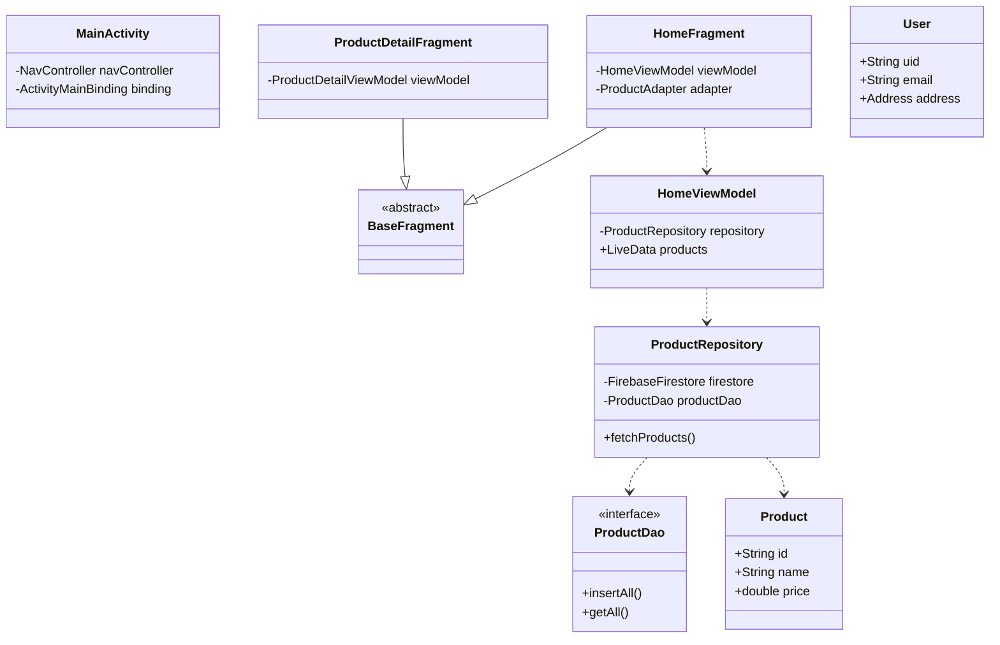
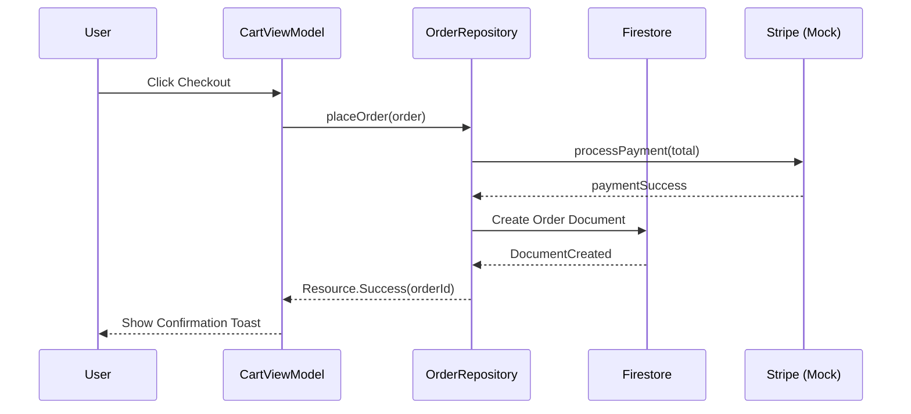

# ShopEasy Diagrams

## Use Case Diagram

```mermaid
usecaseDiagram
    actor "User" as U
    actor "Guest" as G
    actor "Firebase Auth" as FA
    actor "Stripe (Mock)" as S

    package ShopEasy {
        usecase "Browse Products" as UC1
        usecase "Search & Filter" as UC2
        usecase "View Details" as UC3
        usecase "Add to Cart" as UC4
        usecase "Login / Sign up" as UC5
        usecase "Place Order" as UC6
        usecase "View History" as UC7
        usecase "Manage Profile" as UC8
    }

    G --> UC1
    G --> UC2
    G --> UC3
    G --> UC5
    
    U --> UC1
    U --> UC2
    U --> UC3
    U --> UC4
    U --> UC6
    U --> UC7
    U --> UC8

    UC5 -- FA : authenticates
    UC6 -- S : payment processing
```

## Class Diagram



## Order Flow (Sequence Diagram)


