# ShopEasy - Architecture & Flow Diagrams

**Document Purpose**: Comprehensive visual documentation of ShopEasy's architecture, design patterns, and user flows.

---

## 📊 1. System Architecture Diagram


---

## 🎭 2. Use Case Diagram

```mermaid
usecaseDiagram
    actor Guest
    actor "Authenticated User" as AuthUser
    actor "Admin" as Admin
    actor "Firebase" as FB
    actor "Payment Gateway" as Payment

    package "ShopEasy Application" {
        %% Authentication Use Cases
        usecase "Sign Up" as UC_SignUp
        usecase "Login" as UC_Login
        usecase "Logout" as UC_Logout
        usecase "Reset Password" as UC_ResetPwd
        usecase "Google Sign-In" as UC_GoogleAuth
        
        %% Product Management
        usecase "Browse Products" as UC_Browse
        usecase "Search Products" as UC_Search
        usecase "Filter by Category" as UC_Filter
        usecase "View Product Details" as UC_Details
        usecase "Add to Wishlist" as UC_Wishlist
        
        %% Cart Operations
        usecase "Add to Cart" as UC_AddCart
        usecase "Remove from Cart" as UC_RemCart
        usecase "Update Quantity" as UC_UpdateQty
        usecase "Clear Cart" as UC_ClearCart
        
        %% Checkout & Orders
        usecase "Proceed to Checkout" as UC_Checkout
        usecase "Process Payment" as UC_Payment
        usecase "Create Order" as UC_CreateOrder
        usecase "View Order History" as UC_OrderHistory
        usecase "Track Order" as UC_TrackOrder
        usecase "Cancel Order" as UC_CancelOrder
        
        %% User Profile
        usecase "View Profile" as UC_Profile
        usecase "Edit Profile" as UC_EditProfile
        usecase "Toggle Dark Mode" as UC_DarkMode
        usecase "Manage Notifications" as UC_Notifications
        
        %% System Features
        usecase "Receive Notifications" as UC_ReceiveNotif
    }

    %% Guest User flows
    Guest --> UC_Browse
    Guest --> UC_Search
    Guest --> UC_Filter
    Guest --> UC_Details
    Guest --> UC_SignUp
    Guest --> UC_Login
    Guest --> UC_GoogleAuth

    %% Authenticated User flows
    AuthUser --> UC_Browse
    AuthUser --> UC_Search
    AuthUser --> UC_Filter
    AuthUser --> UC_Details
    AuthUser --> UC_AddCart
    AuthUser --> UC_RemCart
    AuthUser --> UC_UpdateQty
    AuthUser --> UC_ClearCart
    AuthUser --> UC_Wishlist
    AuthUser --> UC_Checkout
    AuthUser --> UC_CreateOrder
    AuthUser --> UC_OrderHistory
    AuthUser --> UC_TrackOrder
    AuthUser --> UC_CancelOrder
    AuthUser --> UC_Profile
    AuthUser --> UC_EditProfile
    AuthUser --> UC_DarkMode
    AuthUser --> UC_Notifications
    AuthUser --> UC_Logout

    %% External System interactions
    UC_SignUp --> FB
    UC_Login --> FB
    UC_GoogleAuth --> FB
    UC_ResetPwd --> FB
    UC_Payment --> Payment
    UC_ReceiveNotif --> FB
```

---

## 🏗️ 3. Class Diagram (MVVM Architecture)


---

## 🔄 4. Data Flow Diagram (Product Browsing)


---

## 🔐 5. Authentication Flow (Sequence Diagram)


---

## 🛒 6. Shopping Cart & Checkout Flow (Sequence Diagram)


---

## 🎯 7. State Management Diagram (User Login States)


---

## 📱 8. Screen Navigation Flow


---

## 💾 9. Database Schema Diagram


---

## 🔄 10. Sync & Offline Strategy Diagram

```mermaid
graph TB
    CheckConnection{Network<br/>Available?}
    
    Offline["📴 Offline Mode"]
    Online["📡 Online Mode"]
    
    subgraph "Offline Operations"
        OL1["Read from<br/>Room Cache"]
        OL2["Store changes<br/>locally"]
        OL3["Queue pending<br/>operations"]
    end
    
    subgraph "Online Operations"
        OL4["Sync queued<br/>operations"]
        OL5["Fetch latest<br/>from Firestore"]
        OL6["Update Room<br/>Cache"]
    end
    
    CheckConnection -->|Yes| Online
    CheckConnection -->|No| Offline
    
    Offline --> OL1
    OL1 --> OL2
    OL2 --> OL3
    OL3 -->|Connection<br/>Restored| Online
    
    Online --> OL4
    OL4 --> OL5
    OL5 --> OL6
    OL6 -->|Changes<br/>Synced| Online
```



---

## 🎨 11. Dark Mode Theme Architecture


---

## 📊 Summary

This documentation provides:

- **System Architecture**: Overall app structure
- **Use Cases**: All user interactions and system features
- **Class Relationships**: MVVM implementation and dependency structure
- **Data Flow**: How data moves through the application
- **Authentication**: Secure login process
- **Shopping**: Complete purchase workflow
- **State Management**: UI state transitions
- **Navigation**: Screen flow and transitions
- **Database**: Entity relationships and schema
- **Sync Strategy**: Offline support mechanism
- **Theme**: Dark mode implementation

All diagrams follow modern Android architecture best practices with separation of concerns, reactive programming, and offline-first approach.

